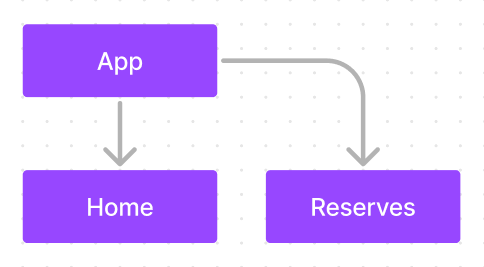

# Pages

Este directorio tendría como motivo principal ir añadiendo las páginas y subpáginas necesarias, únicamente las páginas.
Éstas tendrán la extensión `.pages.tsx`.

Debería ir actualizándose a medida que se amplía el número de páginas que contenga la Aplicación Web.
[Página de Figma](https://www.figma.com/file/0olv9a8xBECrOmcMJ5biHy/Diagramas?type=whiteboard&node-id=0-1&t=Xntlytb528pvdDjC-0)

